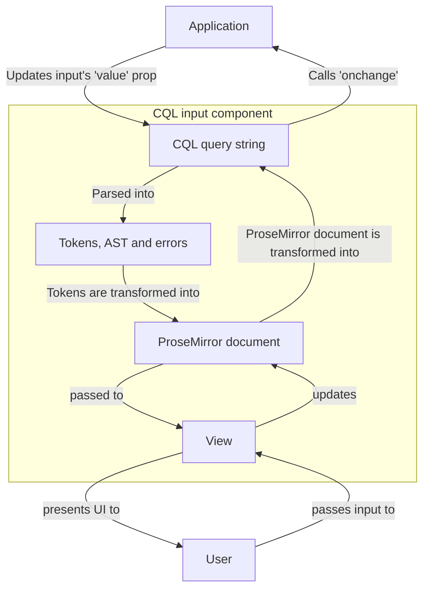

# CQL

An experiment to see if a query DSL, coupled with first-class typeahead and syntax highlighting, might provide a more consistent and discoverable way to search Guardian content.


Play in the sandbox at https://cql-sandbox.gutools.co.uk/.

## Why?

At the moment at the Guardian, there are a few ways to query CAPI:
  - directly, via the API and a query string
  - via many different GUIs across many different tools, each with variable support for the search functionality CAPI has to offer.

Problems:
- API/query string provides all the affordances of CAPI search, but features are not discoverable
- API/query string requires user to understand query strings
- GUIs are inconsistent across estate
- GUIs do not provide all the affordances of CAPI search
- There is no way to move queries between API/GUI or GUI/GUI

| Feature                           | API/Query string  | GUI | Query language + input |
|-----------------------------------|-------------------|-----|------------------------|
| Comprehensible for non-developers | ❌                 | ✅   | ⚖️                     |
| Consistent across estate          | ✅                 | ❌   | ✅                      |
| Expose all search features        | ✅                 | ❌   | ✅                      |
| Can move queries across tools     | ✅                 | ❌   | ✅                      |

One solution might be:
  - a text-based query DSL, addressing problem of affordances and consistency
  - a good syntax-highlighter/typeahead input, wrapped as something that is useable anywhere (e.g. lightweight web component), to address discoverability

## How can I use it?

This repo provides a web component that accepts `placeholder` and `value` attributes, and exposes an event listener, `queryChange`, that work as a HTML `input` element does:

```typescript
// Register the component
const typeaheadGuTools = new Typeahead(guToolsTypeaheadFields);
const CqlInputGuTools = createCqlInput(typeaheadGuTools);
customElements.define("cql-input-gutools", CqlInputGuTools);
```

```html
<!-- Add an input to the document -->
<cql-input id="cql-input-1" value="+tag:article" placeholder="Search for content"></cql-input>
```

```typescript
// Respond to changes
const cqlInputElement = document.getElementById("cql-input-1");
cqlInputElement.addEventListener("queryChange", ({ detail: {
  queryStr,
  queryAst,
  error
}) => {
  // Respond to changes
});
```

## How does it work?

The flow of state within the input looks like:



### Why use tokens to generate the document, rather than the AST?

The token parser is more permissive than the AST parser, so we can represent more document states using tokens. Because, for the purposes of the editor, we only need to understand the difference between fields and query strings, which are effectively flat, the ProseMirror document does not need to reflect the AST's structure.

## Release
This repository uses [changesets](https://github.com/changesets/changesets) for version management.

To release a new version with your changes, run `bun changeset add` and follow the prompts. This will create a new changeset file in the .changeset directory. Commit this file with your PR.

When your PR is merged, Changesets will create a PR to release the new version.
